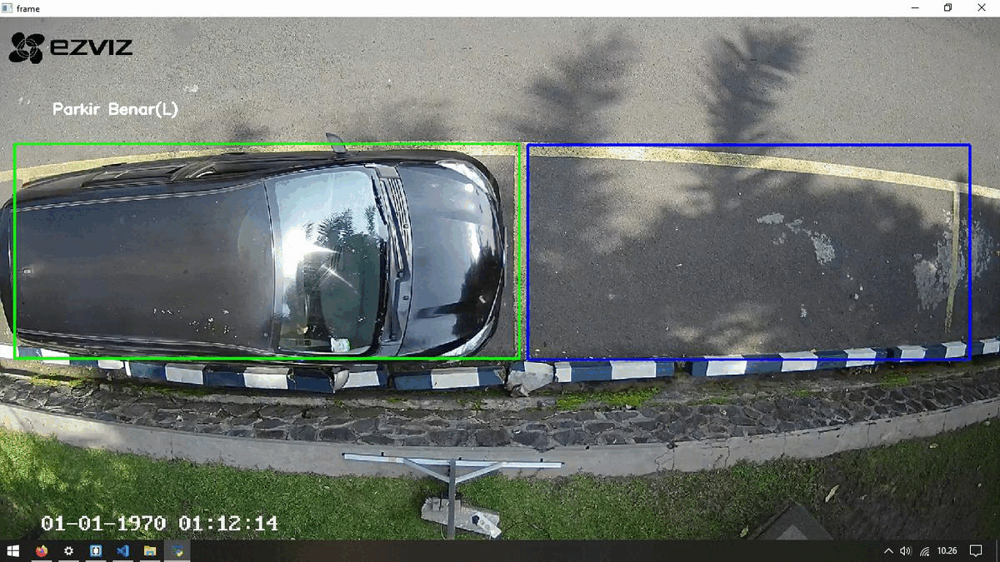

# klasifikasi_parkiran
Model klasfikasi untuk menentukan objek kendaraan dan kebenaran letak kendaraan dalam proses parkir

## **Klasifikasi kendaraan di parkiran dan penempatannya menggunakan TensorFlow**

Terdapat dua model klasifikasi pada projek ini. Model pertama untuk menentukan kendaraan (kelas) yaitu Mobil, Motor, Orang dan Kosong. Model kedua untuk menentukan apakah kendaraan parkir sudah sesuai dengan garis parkira atau tidak.

##***Dataset***
Saya membuat dataset sendiri dengan menggunakan video yang sudah diambil sebelumnya. link dataset dapat di download here.
Dataset model pertama:
https://www.kaggle.com/datasets/dhandiyy/new-parkir
Dataset model kedua:
https://www.kaggle.com/datasets/dhandiyy/parkir-2

Ukuran gambar pada dataset disesuaikan sesuai dengan ukuran kotak parkir agar mendapatkan hasil yang lebih akurat. Dataset pada model pertama terdapat empat kelas yaitu Mobil, Motor, Orang dan Kosong. Dataset pada model kedua menggunakan dua kelas yaitu keadaan parkir yang benar dan salah.

##***Model***
Pembuatan kedua model tersebut menggunakan teknik ****Transfer Learning**** memanfaatkn model yang sudah ada yaitu MobilNetV3 agar mendapatkan model yang berukuran kecil tetapi tetap dapat diandalkan. Model tersebut nantinya dapat digunakan pada perangkat yang mempunyai tingkat komputasi yang rendah.

Pembuatan model pertama:
https://colab.research.google.com/drive/1Mo4g1imyqN90GUwIAm611FpXaBCyXgvF?usp=sharing
Pembuaan model kedua:
https://colab.research.google.com/drive/1DdNjcNxFeU-n2RwIhuf9DRajPU0G5CRl?usp=sharing

